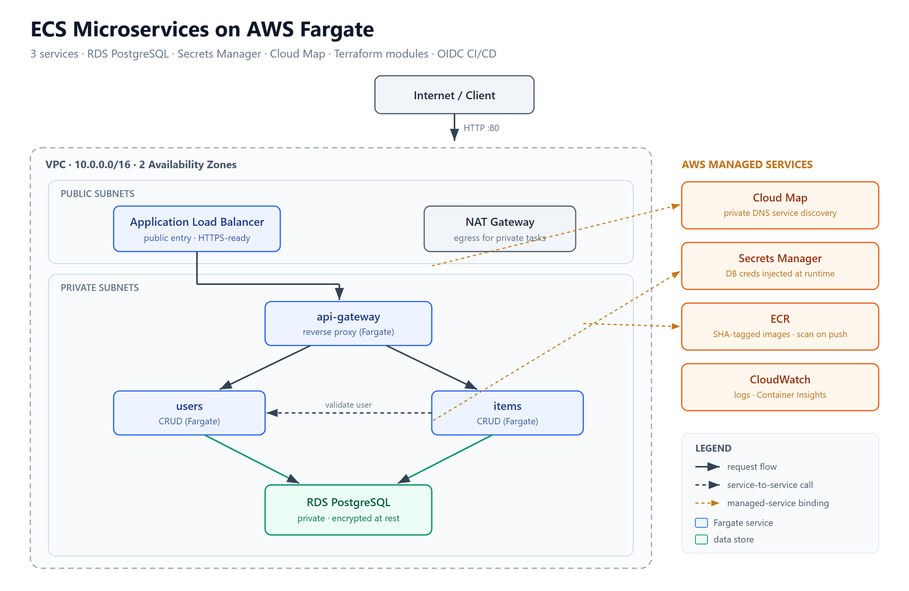
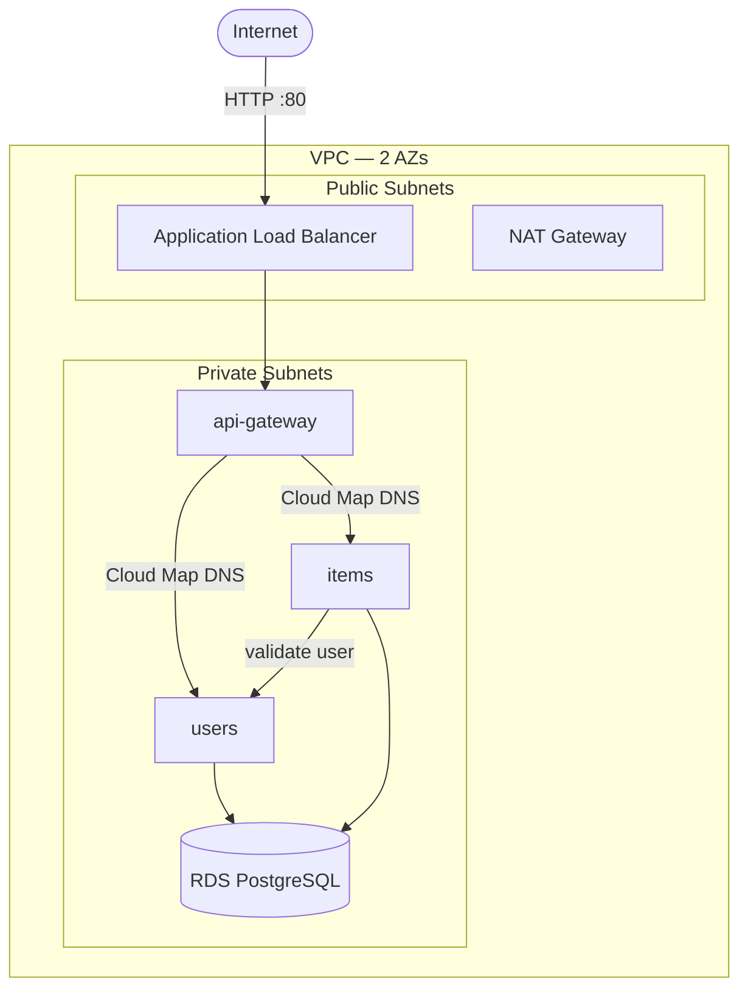

# ECS Microservices

Three FastAPI microservices on AWS ECS Fargate with RDS PostgreSQL, Secrets Manager credential injection, Cloud Map service discovery, and multi-environment Terraform.

Part of a [4-project DevOps portfolio](https://github.com/fuhchu).

## Architecture





## Services

| Service | Role | Public |
|---|---|---|
| api-gateway | Reverse proxy; single public entry point | Yes (ALB) |
| users | User CRUD, owns `users` table | Internal only |
| items | Item CRUD, owns `items` table, validates users via service call | Internal only |

## Infrastructure

| Component | Technology |
|---|---|
| Compute | ECS Fargate (serverless containers) |
| Database | RDS PostgreSQL, private subnets, encrypted at rest |
| Secrets | AWS Secrets Manager — DB password never hardcoded |
| Service discovery | AWS Cloud Map (`ecs-msvc.local` private DNS) |
| Load balancing | Application Load Balancer (public), HTTPS-ready |
| IaC | Terraform — one module, `dev.tfvars` / `prod.tfvars` |
| CI/CD | GitHub Actions — path-filtered per service, OIDC auth |

## Multi-environment

```bash
# Dev (cost-optimized: 1 NAT, t3.micro RDS single-AZ, 1 task each)
terraform apply -var-file=dev.tfvars

# Prod (HA: 1 NAT per AZ, t3.small Multi-AZ RDS, 2 tasks each)
terraform apply -var-file=prod.tfvars
```

## CI/CD

Each service has its own GitHub Actions pipeline that triggers **only when that service's directory changes**. Pushing to `services/users/` deploys only the users service — items and api-gateway are untouched.

- Keyless AWS authentication via OIDC (no stored credentials)
- Images tagged with git SHA for full traceability
- `wait-for-service-stability` — pipeline fails if ECS rolls back
- Infra pipeline: `plan` on PR, `apply` on merge to main

## Docs

- [Architecture](docs/ARCHITECTURE.md) — full diagram, component breakdown, design decisions
- [Runbook](docs/RUNBOOK.md) — operational troubleshooting by plane (network, compute, data/secrets, delivery)
- [Interview Notes](docs/INTERVIEW-NOTES.md) — Q&A covering containers, networking, secrets, CI/CD, IaC
