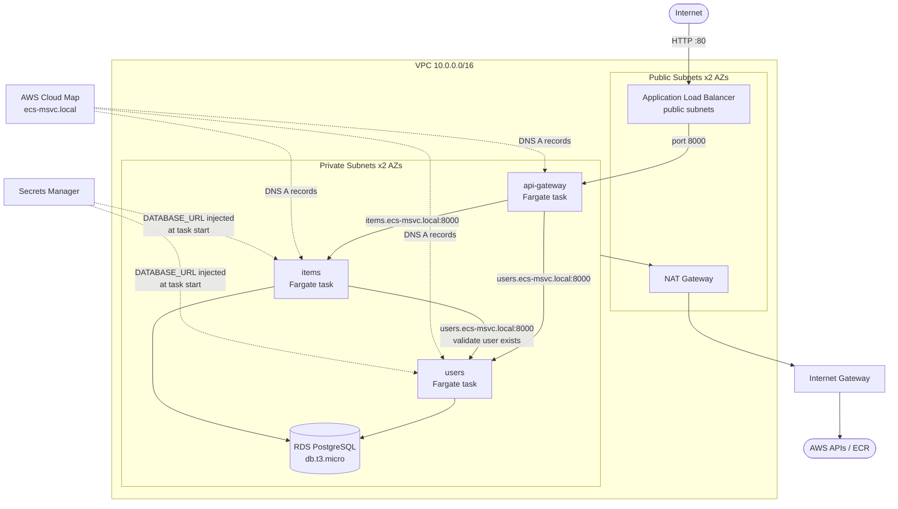

# Architecture — ECS Microservices

## Overview

Three FastAPI microservices running on AWS ECS Fargate, backed by a shared RDS PostgreSQL database, with service-to-service discovery via AWS Cloud Map. Public traffic enters through a single Application Load Balancer to the api-gateway, which proxies requests to the internal services.

## Architecture Diagram

## Services

| Service | Responsibility | Public? | DB access |
|---|---|---|---|
| api-gateway | Reverse proxy; single public entry point | Yes (via ALB) | No |
| users | User CRUD; owns `users` table | No (internal only) | Yes |
| items | Item CRUD; owns `items` table; validates users via service call | No (internal only) | Yes |

## Request Flow

### Create an item (`POST /items`)
1. Client → ALB (public DNS) on port 80
2. ALB → api-gateway Fargate task (port 8000, private subnet)
3. api-gateway → items service via Cloud Map DNS (`items.ecs-msvc.local:8000`)
4. items → users service via Cloud Map DNS to validate `user_id` exists
5. items → RDS PostgreSQL (private subnet, port 5432) to persist the item
6. Response propagates back through the chain

## Infrastructure Components

### Networking
- **VPC** — `10.0.0.0/16`, 2 AZs, public + private subnets per AZ
- **NAT Gateway** — 1 shared in dev (cost), 1 per AZ in prod (HA); private tasks route outbound through it to reach ECR and AWS APIs
- **Security groups** — layered: ALB SG (0.0.0.0/0 → 80/443), ECS tasks SG (VPC CIDR → 8000), RDS SG (ECS tasks SG → 5432 only)

### Compute
- **ECS Fargate** — serverless containers; no EC2 instances to patch or manage
- **Task definitions** — 256 CPU / 512 MB per task in dev; secrets injected at start via Secrets Manager references
- **Deployment circuit breaker** — auto-rollback if new tasks fail health checks

### Database
- **RDS PostgreSQL 18** — `db.t3.micro` single-AZ in dev, `db.t3.small` Multi-AZ in prod
- **Private subnets only** — `publicly_accessible = false`; no internet path to the DB
- **Encrypted at rest** — `storage_encrypted = true` on gp3 storage

### Secrets Management
- **AWS Secrets Manager** — DB password generated by Terraform `random_password`, never written by a human
- **Secret structure** — JSON with `username`, `password`, `host`, `port`, `dbname`, `database_url`
- **Injection** — ECS pulls `database_url` key at task start via the task execution role; app reads `os.environ["DATABASE_URL"]`

### Service Discovery
- **AWS Cloud Map** — private DNS namespace `ecs-msvc.local`; each ECS service registers an A record
- **MULTIVALUE routing** — returns all healthy task IPs; client-side load distribution
- **TTL 10s** — fast convergence when tasks are replaced

### CI/CD
- **GitHub Actions** — 4 workflows: one per service + one for Terraform infra
- **Path filtering** — each service pipeline only triggers on changes to its own `services/<name>/` directory
- **OIDC authentication** — keyless; no stored AWS credentials in GitHub; role scoped to `fuhchu/ecs-microservices` repo + `main` branch only
- **SHA-tagged images** — every image tagged with the git commit SHA for full traceability
- **Infra pipeline** — `terraform plan` on PR (posted as comment), `terraform apply` on merge to main

### Multi-environment
- **Same Terraform, two var files** — `dev.tfvars` (cheap) and `prod.tfvars` (HA)
- **Remote state** — S3 bucket `chu-statefile`, key `ecs-microservices/terraform.tfstate`, S3-native locking

## Key Design Decisions

| Decision | Rationale |
|---|---|
| Single shared RDS (not one DB per service) | Pragmatic for a 3-service portfolio; true microservice isolation would use separate DB instances or schemas per service, trading cost/complexity for blast-radius reduction |
| Cloud Map over internal ALB per service | Lighter and cheaper for direct service-to-service calls; internal ALB adds L7 routing and connection draining but costs ~$16/mo per ALB |
| Synchronous inter-service HTTP (not async events) | Simpler to reason about at this scale; async (SQS/SNS) would decouple services and improve resilience at the cost of eventual consistency |
| api-gateway as dumb proxy (no domain knowledge) | Adding fields to users/items doesn't require touching the gateway; tradeoff is no request validation at the edge |
| `recovery_window_in_days = 0` on the secret | Allows immediate delete/recreate during teardown; prod would use 7–30 days |
